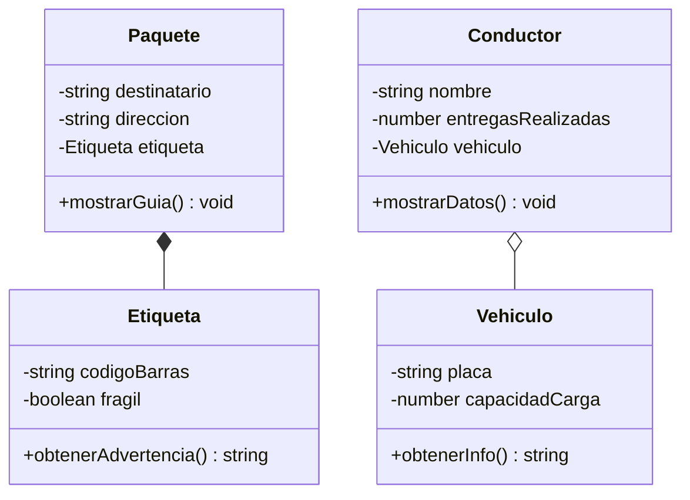

```mermaid
classDiagram

class Vehiculo{
    -string placa
    -number capacidadCarga
    +obtenerInfo() string
}

class Etiqueta{
    -string codigoBarras
    -boolean fragil
    +obtenerAdvertencia() string
}

class Paquete{
    -string destinatario
    -string direccion
    -Etiqueta etiqueta
    +mostrarGuia() void
}

class Conductor{
    -string nombre
    -number entregasRealizadas
    -Vehiculo vehiculo
    +mostrarDatos() void
}

Conductor o-- Vehiculo
Paquete *-- Etiqueta
```

